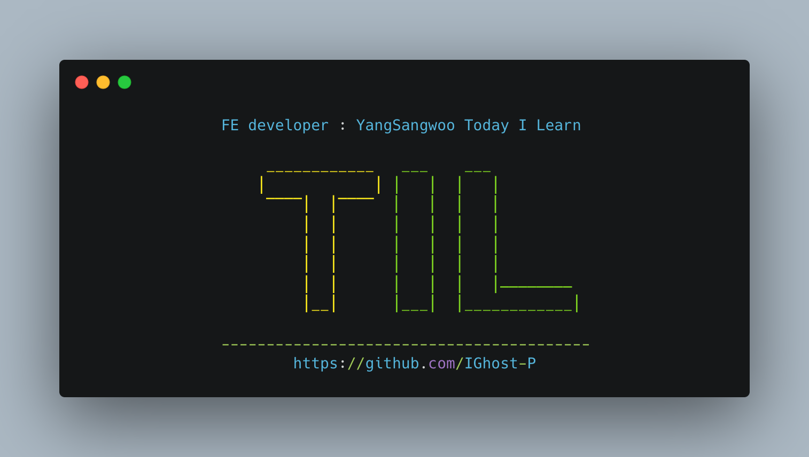

# TIL 간단회고

- 우선순위큐와 readline방식을 잘 파악해서 사용하자
- 집중도를 좀도 올리자

# Today I Learned

- [x] 백준 알고리즘
- [x] jest

---

# 📹 동영상

[](https://youtu.be/RBp3ntN-qn8)

# 1202 : 보석도둑

## 문제풀이

1. 그리디로 풀면 너무 큰 배열을 2번 순회해야하므로 약 n2~nlogn 정도 시간복잡도가 생긴다
2. maxHeap을 이용 ⇒ 가방을 기준으로 보석을 넣을수 있으면 넣어주고, 그중 가능한 가방을 maxHeap에 넣어주면 maxHeap의 최대값 = 해당 가방으로 가질수있는 최대 가치
3. 모든 가방을 반복해주면서 answer에 넣으면 된다

### 첫번째 풀이

```jsx
[NK, ...testCase] = require("fs")
  .readFileSync(process.platform === "linux" ? "/dev/stdin" : "./input.txt")
  .toString()
  .trim()
  .split("\n");

const [N, K] = NK.split(" ").map((e) => +String(BigInt(e)));

const jewel = testCase
  .slice(0, N)
  .map((e) => e.split(" ").map((e) => +String(BigInt(e))))
  .sort((a, b) => a[0] - b[0]);

const bag = testCase
  .slice(N)
  .map((e) => [+String(BigInt(e)), 0])
  .sort((a, b) => a[0] - b[0]);

const pq = [];
let answer = 0;
let idx = 0;
for (let i = 0; i < K; i++) {
  while (idx < N && jewel[idx][0] <= bag[i][0]) {
    pq.push(String(BigInt(jewel[idx][1])));
    idx++;
  }

  pq.sort((a, b) => a - b);

  if (pq.length) {
    answer += +String(BigInt(pq.pop()));
  }
}

console.log(String(BigInt(answer)));
```

아무래도 10000000길이를 sort하다보니 메모리 초과 문제가 생기는것 같다, maxHeap 자료 구조를 구현해서 사용하자

```jsx
class MaxHeap {
  constructor() {
    this.heap = [];
  }
  swap(a, b) {
    // 구조분해 할당 문법으로 swap 가능
    [this.heap[a], this.heap[b]] = [this.heap[b], this.heap[a]];
  }
  size() {
    return this.heap.length;
  }
  push(value) {
    // 맨뒤에 추가 max heap 이므로 부모랑 비교해서 큰값을 부모랑 swap 해줘야함
    this.heap.push(value);
    let idx = this.heap.length - 1;
    let parent = Math.floor((idx - 1) / 2);

    while (this.heap[parent] < value) {
      this.swap(parent, idx);
      idx = parent;
      parent = Math.floor((idx - 1) / 2);
    }
    // return this.print()
  }
  // 큐이기 때문에 삭제는 항상 루트노드부터 이루어짐. 루트 노드를 삭제하고, 맨마지막 인덱스를 루트랑 교환

  pop() {
    const lastIdx = this.heap.length - 1;
    let idx = 0;
    this.swap(0, lastIdx); // 0번이 루트노드
    let value = this.heap.pop();

    while (idx < lastIdx) {
      let leftChildIdx = idx * 2 + 1;
      let rightChildIdx = idx * 2 + 2;

      // 왼쪽자식 인덱스가 더 크다는 뜻은 자식노드가 없다는 뜻
      if (leftChildIdx >= lastIdx) {
        break;
      } else if (rightChildIdx >= lastIdx) {
        // 왼쪽 자식만 있는경우 자식과 비교해서 크면 스왑
        if (this.heap[idx] < this.heap[leftChildIdx]) {
          this.swap(idx, leftChildIdx);
          idx = leftChildIdx;
        } else {
          break;
        }
      } else {
        // 둘다 있는경우 중 두 자식이 루트보다 다 큰경우
        if (
          this.heap[leftChildIdx] > this.heap[idx] &&
          this.heap[rightChildIdx] > this.heap[idx]
        ) {
          // 큰값이랑 스왑
          if (this.heap[leftChildIdx] > this.heap[rightChildIdx]) {
            this.swap(idx, leftChildIdx);
            idx = leftChildIdx;
          } else {
            this.swap(idx, rightChildIdx);
            idx = rightChildIdx;
          }
        } else if (this.heap[leftChildIdx] > this.heap[idx]) {
          // 왼쪽 자식만 루트보다 클 경우
          this.swap(leftChildIdx, idx);
          idx = leftChildIdx;
        } else if (this.heap[rightChildIdx] > this.heap[idx]) {
          // 오른쪽 자식
          this.swap(rightChildIdx, idx);
          idx = rightChildIdx;
        } else {
          // 둘다 작을경우 안바꿈
          break;
        }
      }
    }
    return value;
  }

  print() {
    console.log(this.heap);
  }
}

const fs = require("fs");
const input = fs
  .readFileSync("dev/stdin")
  .toString()
  .trim()
  .split("\n")
  .map((v) => v.split(" ").map(Number));
const [N, K] = input.shift();
let jewel = input.splice(0, N).sort((a, b) => a[0] - b[0]);
let bag = input.map((v) => v[0]).sort((a, b) => a - b);
let answer = 0;
let possible = new MaxHeap();

let j = 0;
for (let i = 0; i < K; i++) {
  while (j < N && jewel[j][0] <= bag[i]) {
    possible.push(jewel[j][1]);
    j++;
  }

  if (possible.size()) {
    answer += possible.pop();
  }
}

console.log(answer);
```

# 2075 : N번째 큰수

## 문제풀이


1. 배열을 돌면서 우선순위큐(max heap)에더 집어넣음
2. 원하는 n보다 큐의 길이가 길어진다면, 가장 작은수를 뺀다
3. 이렇게하다보면 큐는 가장 큰 값부터 n번째 큰수까지 있다

## 첫풀이

```jsx
[N, ...testCase] = require("fs")
  .readFileSync(process.platform === "linux" ? "/dev/stdin" : "./input.txt")
  .toString()
  .trim()
  .split("\n")
  .map((v) => v.split(" ").map(Number));

const queue = [];
for (let i = 0; i < N; i++) {
  for (let j = 0; j < N; j++) {
    queue.push(testCase[i][j]);

    if (queue.length > N) {
      queue.sort((a, b) => b - a);
      queue.pop();
    }
  }
}

console.log(queue.pop());
```


로직자체가 문제가 되지 않지만, sort하는 과정과 입력값을 받는 과정에서 메모리 초과가 난다(입력값이 커지면 fs로 받아올수있는 한계가 있는듯 ⇒ readline으로 해결하자)

```jsx
const readline = require("readline");
const rl = readline.createInterface({
  input: process.stdin,
  output: process.stdout,
});

class Heap {
  constructor() {
    this.items = [];
  }
  swap(index1, index2) {
    let temp = this.items[index1];
    this.items[index1] = this.items[index2];
    this.items[index2] = temp;
  }
  parentIndex(index) {
    return Math.floor((index - 1) / 2);
  }
  leftChildIndex(index) {
    return index * 2 + 1;
  }
  rightChildIndex(index) {
    return index * 2 + 2;
  }
  parent(index) {
    return this.items[this.parentIndex(index)];
  }
  leftChild(index) {
    return this.items[this.leftChildIndex(index)];
  }
  rightChild(index) {
    return this.items[this.rightChildIndex(index)];
  }
  peek() {
    return this.items[0];
  }
  size() {
    return this.items.length;
  }
}
class MinHeap extends Heap {
  //bubbleUp
  bubbleUp() {
    let index = this.items.length - 1;
    while (
      this.parent(index) !== undefined &&
      this.parent(index) > this.items[index]
    ) {
      this.swap(index, this.parentIndex(index));
      index = this.parentIndex(index);
    }
  }
  //bubbleDown
  bubbleDown() {
    let index = 0;
    while (
      this.leftChild(index) !== undefined &&
      (this.leftChild(index) < this.items[index] ||
        this.rightChild(index) < this.items[index])
    ) {
      let smallerIndex = this.leftChildIndex(index);
      if (
        this.rightChild(index) !== undefined &&
        this.rightChild(index) < this.items[smallerIndex]
      ) {
        smallerIndex = this.rightChildIndex(index);
      }
      this.swap(index, smallerIndex);
      index = smallerIndex;
    }
  }
  //add
  add(item) {
    this.items[this.items.length] = item;
    this.bubbleUp();
  }
  //poll
  poll() {
    let item = this.items[0];
    this.items[0] = this.items[this.items.length - 1];
    this.items.pop();
    this.bubbleDown();
    return item;
  }
}

const queue = new MinHeap();
let n = 0;
let count = -1;

rl.on("line", function (line) {
  //  첫 입력값은 n
  if (count === -1) {
    count = parseInt(line);
    n = count;
    return;
  }

  // 이후 다음 줄부터 n개의 숫자가 입력됨을 스페이스바로 띄움
  line.split(" ").forEach((v) => {
    queue.add(parseInt(v));

    if (queue.size() > n) {
      queue.poll();
    }
  });

  // n번 반복 하다가 0이 되면 끝
  count--;
  if (count === 0) rl.close();
}).on("close", function () {
  console.log(queue.peek());
  process.exit();
});
```


# Jset

# 코드 퀴즈 2

> Disabled Button Gray Code Quiz Spec

### Mockup


### Spec

- use web color "gray"
- Test flows:
  - disable button → button is gray → enable button → button is red
  - click button to change color → disable btn → btn is gray → enable btn → btn is blue

## 테스트 코드

### 나의 답

```jsx
import { render, screen, fireEvent } from "@testing-library/react";
import App from "./App";

test("test click btn color status", () => {
  render(<App />);

  const button = screen.getByRole("button", { name: "Change to blue" });

  expect(button).toHaveStyle({ backgroundColor: "red" });

  fireEvent.click(button);

  expect(button).toHaveStyle({ backgroundColor: "blue" });
  expect(button.textContent).toBe("Change to red");
});

test("checkbox click => button disable", () => {
  render(<App />);

  const checkbox = screen.getByRole("checkbox");
  const button = screen.getByRole("button");

  fireEvent.click(checkbox);
  expect(button).toBeDisabled();

  fireEvent.click(checkbox);
  expect.toBeEnabled();
});

test("checkbox name is disable button", () => {
  render(<App />);

  const checkbox = screen.getByRole("checkbox", { name: "Disable button" });

  expect(checkbox).not.toBeChecked();
});

test("chekcbox clicked -> button is gray", () => {
  render(<App />);

  const checkbox = screen.getByRole("checkbox", { name: "Disable button" });
  const button = screen.getByRole("button");

  fireEvent.click(checkbox);
  expect(button).toHaveStyle({ backgroundColor: "gray" });

  fireEvent.click(checkbox);
  expect(button).toHaveStyle({ backgroundColor: "red" });
});

test("After chaged button color to blue, checkbox clicked -> button is gray", () => {
  render(<App />);

  const button = screen.getByRole("button");
  const checkbox = screen.getByRole("checkbox", { name: "Disable button" });

  fireEvent.click(button);
  fireEvent.click(checkbox);

  expect(button).toHaveStyle({ backgroundColor: "gray" });

  fireEvent.click(checkbox);
  expect(button).toHaveStyle({ backgroundColor: "blue" });
});
ㄹ;
```

### 센세 답

```jsx
import { render, screen, fireEvent } from "@testing-library/react";
import App from "./App";
import { replaceCamelWithSpaces } from "./App";

test("button has correct initial color", () => {
  render(<App />);

  // find an element with a role of button and text of 'Change to blue'
  const colorButton = screen.getByRole("button", { name: "Change to blue" });

  // expect the background color to be red
  expect(colorButton).toHaveStyle({ backgroundColor: "red" });

  // click button
  fireEvent.click(colorButton);

  // expect the background color to be blue
  expect(colorButton).toHaveStyle({ backgroundColor: "blue" });

  // expect the button text to be 'Change to red'
  expect(colorButton.textContent).toBe("Change to red");
});

test("initial conditions", () => {
  render(<App />);

  // check that the button starts out enabled
  const colorButton = screen.getByRole("button", { name: "Change to blue" });
  expect(colorButton).toBeEnabled();

  // check that the checkbox starts out unchecked
  const checkbox = screen.getByRole("checkbox");
  expect(checkbox).not.toBeChecked();
});

test("Checkbox disables button on first click and enables on second click", () => {
  render(<App />);
  const checkbox = screen.getByRole("checkbox", { name: "Disable button" });
  const colorButton = screen.getByRole("button", { name: "Change to blue" });

  fireEvent.click(checkbox);
  expect(colorButton).toBeDisabled();

  fireEvent.click(checkbox);
  expect(colorButton).toBeEnabled();
});

test("Disabled button has gray background and reverts to red", () => {
  render(<App />);
  const checkbox = screen.getByRole("checkbox", { name: "Disable button" });
  const colorButton = screen.getByRole("button", { name: "Change to blue" });

  // disable button
  fireEvent.click(checkbox);
  expect(colorButton).toHaveStyle("background-color: gray");

  // re-enable button
  fireEvent.click(checkbox);
  expect(colorButton).toHaveStyle("background-color: red");
});

test("Clicked disabled button has gray background and reverts to blue", () => {
  render(<App />);
  const checkbox = screen.getByRole("checkbox", { name: "Disable button" });
  const colorButton = screen.getByRole("button", { name: "Change to blue" });

  // change button to blue
  fireEvent.click(colorButton);

  // disable button
  fireEvent.click(checkbox);
  expect(colorButton).toHaveStyle("background-color: gray");

  // re-enable button
  fireEvent.click(checkbox);
  expect(colorButton).toHaveStyle("background-color: blue");
});
```

## 구현 화면

### 빨강 → 회색 → 빨강

### 파랑 → 회색 → 파랑

---

# 함수를 위한 유닛 테스팅

<aside>
💡 **단위 테스트**

- 단위 테스트는 프로그래머에 의해, 프로그래머를 위해 시스템 프로그래밍 언어로 만든 테스트다.
- 단위 테스트는 시스템의 최하위 계층을 명세하려는 의도로 만든다.
- 단위 테스트의 커버리지는 최대한 100%에 가까워야 한다. 보통 커버리지의 목표는 90 ~ 99% 사이가 되어야 한다.
</aside>

리액트에서는 종종 컴포넌트와 분리되어있는 함수가 있다

- 이러한 함수는 다수의 컴포넌트가 중복해서 사용하는 함수이다
- 또는 복잡한 로직이기 때문에 컴포넌트에서 분리한 경우이다

함수의 유닛 테스트는

- 너무 복잡한 로직이거나, 너무 큰 로직인 경우에 유닛 테스트를 권장한다
- 또는 너무 많은 엣지 케이스가 있는경우 권장한다

<aside>
💡 **엣지케이스**

엣지 케이스란 알고리즘이 처리하는 데이터의 값이 알고리즘의 특성에 따른 일정한 범위를 넘을 경우에 발생하는 문제를 가리킨다.

예를 들면 fixnum이라는 변수의 값이 -128 ~ 127의 범위를 넘는 순간 문제가 발생하는 경우가 있을 수 있다. 어떤 분모가 0이 되는 상황처럼 데이터의 특정값에 대해 문제가 발생하는 경우도 마찬가지다.

엣지 케이스는 알고리즘의 특성에 따라 개발자가 면밀히 검토하여 예상할 수 있는 문제다. 이런 문제는 디버그가 쉽기도 하고 테스트를 통해 미리 방지하기도 쉽다.

비슷한 상황을 가리키는 용어로 **[경계 케이스(boundary case)](http://en.wikipedia.org/wiki/Boundary_case)**가 있다.

</aside>

### discribe 문장

> 테스트를 조합할때 사용한다

app.js

```jsx
import { useState } from "react";

export function replaceCamelWithSpaces(colorName) {
  return colorName.replace(/\B([A-Z])\B/g, " $1");
}
function App() {
  const [buttonColor, setButtonColor] = useState("red");
  const [disabled, setDisabled] = useState(false);

  const newButtonColor = buttonColor === "red" ? "blue" : "red";

  return (
    <div>
      <button
        style={{ backgroundColor: disabled ? "gray" : buttonColor }}
        onClick={() => setButtonColor(newButtonColor)}
        disabled={disabled}
      >
        Change to {newButtonColor}
      </button>
      <br />
      <input
        type="checkbox"
        id="disable-button-checkbox"
        defaultChecked={disabled}
        aria-checked={disabled}
        onChange={(e) => setDisabled(e.target.checked)}
      />
      <label htmlFor="disable-button-checkbox">Disable button</label>
    </div>
  );
}

export default App;
```

```jsx
import { render, screen, fireEvent } from "@testing-library/react";
import { replaceCamelWithSpaces } from "./App";
import App from "./App";

test("test click btn color status", () => {
  render(<App />);

  const button = screen.getByRole("button", { name: "Change to blue" });

  expect(button).toHaveStyle({ backgroundColor: "red" });

  fireEvent.click(button);

  expect(button).toHaveStyle({ backgroundColor: "blue" });
  expect(button.textContent).toBe("Change to red");
});

test("checkbox click => button disable", () => {
  render(<App />);

  const checkbox = screen.getByRole("checkbox");
  const button = screen.getByRole("button");

  fireEvent.click(checkbox);
  expect(button).toBeDisabled();

  fireEvent.click(checkbox);
  expect.toBeEnabled();
});

test("checkbox name is disable button", () => {
  render(<App />);

  const checkbox = screen.getByRole("checkbox", { name: "Disable button" });

  expect(checkbox).not.toBeChecked();
});

test("chekcbox clicked -> button is gray", () => {
  render(<App />);

  const checkbox = screen.getByRole("checkbox", { name: "Disable button" });
  const button = screen.getByRole("button");

  fireEvent.click(checkbox);
  expect(button).toHaveStyle({ backgroundColor: "gray" });

  fireEvent.click(checkbox);
  expect(button).toHaveStyle({ backgroundColor: "red" });
});

test("After chaged button color to blue, checkbox clicked -> button is gray", () => {
  render(<App />);

  const button = screen.getByRole("button");
  const checkbox = screen.getByRole("checkbox", { name: "Disable button" });

  fireEvent.click(button);
  fireEvent.click(checkbox);

  expect(button).toHaveStyle({ backgroundColor: "gray" });

  fireEvent.click(checkbox);
  expect(button).toHaveStyle({ backgroundColor: "blue" });
});

describe("spaces before camel-case capital letters", () => {
  test("Works for no inner capital letters", () => {
    expect(replaceCamelWithSpaces("Red")).toBe("Red");
  });
  test("Works for one inner capital letter", () => {
    expect(replaceCamelWithSpaces("MidnightBlue")).toBe("Midnight Blue");
  });
  test("Works for multiple inner capital letters", () => {
    expect(replaceCamelWithSpaces("MediumVioletRed")).toBe("Medium Violet Red");
  });
});
```

함수의 리턴값을 toBe로 받아 예상 할 수 있다

---

# 퀴즈 3

> Color with spaces

### Spec

- Color starts with MediumVioletRed and changes to MidnightBlue
- Need to update existing tests since behavior changed
- Tests for checkbox disabling should still pass

```jsx
import { render, screen, fireEvent } from "@testing-library/react";
import { replaceCamelWithSpaces } from "./App";
import App from "./App";

test("test click btn color status", () => {
  render(<App />);

  const button = screen.getByRole("button", {
    name: "Change to Midnight Blue",
  });

  expect(button).toHaveStyle({ backgroundColor: "Medium VioletRed" });

  fireEvent.click(button);

  expect(button).toHaveStyle({ backgroundColor: "Midnight Blue" });
  expect(button.textContent).toBe("Change to Medium Violet Red");
});

test("checkbox click => button disable", () => {
  render(<App />);

  const checkbox = screen.getByRole("checkbox");
  const button = screen.getByRole("button");

  fireEvent.click(checkbox);
  expect(button).toBeDisabled();

  fireEvent.click(checkbox);
  expect.toBeEnabled();
});

test("checkbox name is disable button", () => {
  render(<App />);

  const checkbox = screen.getByRole("checkbox", { name: "Disable button" });

  expect(checkbox).not.toBeChecked();
});

test("chekcbox clicked -> button is gray", () => {
  render(<App />);

  const checkbox = screen.getByRole("checkbox", { name: "Disable button" });
  const button = screen.getByRole("button");

  fireEvent.click(checkbox);
  expect(button).toHaveStyle({ backgroundColor: "gray" });

  fireEvent.click(checkbox);
  expect(button).toHaveStyle({ backgroundColor: "Midium VioletRed" });
});

test("After chaged button color to Midnight Blue, checkbox clicked -> button is gray", () => {
  render(<App />);

  const button = screen.getByRole("button");
  const checkbox = screen.getByRole("checkbox", { name: "Disable button" });

  fireEvent.click(button);
  fireEvent.click(checkbox);

  expect(button).toHaveStyle({ backgroundColor: "gray" });

  fireEvent.click(checkbox);
  expect(button).toHaveStyle({ backgroundColor: "Midnight Blue" });
});

describe("spaces before camel-case capital letters", () => {
  test("Works for no inner capital letters", () => {
    expect(replaceCamelWithSpaces("Red")).toBe("Red");
  });
  test("Works for one inner capital letter", () => {
    expect(replaceCamelWithSpaces("MidnightBlue")).toBe("Midnight Blue");
  });
  test("Works for multiple inner capital letters", () => {
    expect(replaceCamelWithSpaces("MediumVioletRed")).toBe("Medium Violet Red");
  });
});
```

[]()

## 구현 화면

---

# 유닛테스트를 하는 경우

1. 앞서말한 복잡한 경우와 분리된경우
2. 기능 테스트의 실패 원인을 판단하려는 경우
   1. 실패 저항력이 좋다진다 ⇒ 테스트의 복원력이 좋아짐
   2. 하지만 높은 수준의 코드라면 원인이 광범위해진다

---

# 마지막으로

> 취업 결정은 난거 같으니 마무리만 잘하자!
