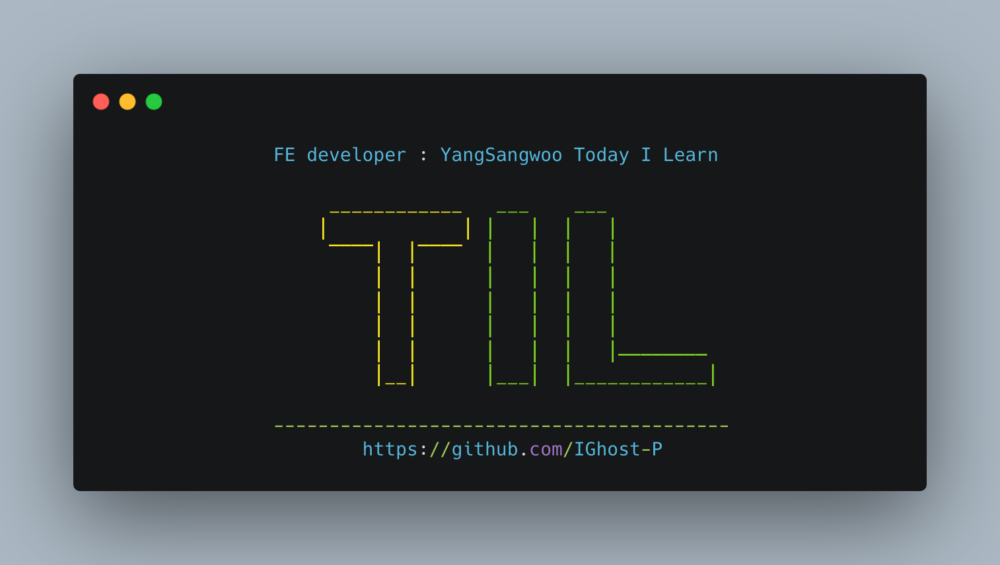

# TIL 간단회고

> BFS와 DFS는 Boolean 으로 푸는게 편한것 같다 while 보다는 for를 이용해서 풀어보자 (network이용) <br />
> 비동기쪽을 내일 내로 끝내고, node.js + react 로 넘어가야겠다, 그리고 포트폴리오 준비를 하자 < br />
> 영단어를 많이 외우자, day - 3를 항상 반복 학습하자. (할때 3일전 영상 같이 보기)

# Today I Learned

- [x] 토익
- [x] 알고리즘
- [x] 바닐라 JS

---

# 📹 동영상

[](https://youtu.be/BuksRkhT-sI)

# VanillaJS

## Coding Challeng # 1

```jsx
// Coding Challenge #1

/* 
In this challenge you will build a function 'whereAmI' which renders a country ONLY based on GPS coordinates. For that, you will use a second API to geocode coordinates.

Here are your tasks:

PART 1
1. Create a function 'whereAmI' which takes as inputs a latitude value (lat) and a longitude value (lng) (these are GPS coordinates, examples are below).
2. Do 'reverse geocoding' of the provided coordinates. Reverse geocoding means to convert coordinates to a meaningful location, like a city and country name. Use this API to do reverse geocoding: https://geocode.xyz/api.
The AJAX call will be done to a URL with this format: https://geocode.xyz/52.508,13.381?geoit=json. Use the fetch API and promises to get the data. Do NOT use the getJSON function we created, that is cheating 😉
3. Once you have the data, take a look at it in the console to see all the attributes that you recieved about the provided location. Then, using this data, log a messsage like this to the console: 'You are in Berlin, Germany'
4. Chain a .catch method to the end of the promise chain and log errors to the console
5. This API allows you to make only 3 requests per second. If you reload fast, you will get this error with code 403. This is an error with the request. Remember, fetch() does NOT reject the promise in this case. So create an error to reject the promise yourself, with a meaningful error message.

PART 2
6. Now it's time to use the received data to render a country. So take the relevant attribute from the geocoding API result, and plug it into the countries API that we have been using.
7. Render the country and catch any errors, just like we have done in the last lecture (you can even copy this code, no need to type the same code)

TEST COORDINATES 1: 52.508, 13.381 (Latitude, Longitude)
TEST COORDINATES 2: 19.037, 72.873
TEST COORDINATES 2: -33.933, 18.474

GOOD LUCK 😀
*/

// 내 답
function whereAmI(lat, lng) {
  // helper function
  const getJson = (url, errMsg = "Error!") => {
    return fetch(`${url}`).then((res) => {
      if (!res.ok) throw new Error(`${errMsg} ${res.status}`);
      return res.json();
    });
  };

  // main
  let url = `https://geocode.xyz/${lat},${lng}?geoit=json`;
  getJson(url, `url is not found`)
    .then((data) => {
      console.log(`You are in ${data.city}, ${data.country}`);
      return fetch(`https://restcountries.com/v2/name/${data.country}`);
    })
    .then((res) => {
      if (!res.ok) throw new Error(`Country not found ${res.status}`);
      return res.json();
    })
    .then((data) => {
      renderCountry(data[0]);
    })
    .catch((err) => console.error(err));
}
let lat = 52.508;
let lng = 13.381;

whereAmI(lat, lng);

//센세 답

const whereAmI = function (lat, lng) {
  fetch(`https://geocode.xyz/${lat},${lng}?geoit=json`)
    .then((res) => {
      if (!res.ok) throw new Error(`Problem with geocoding ${res.status}`);
      return res.json();
    })
    .then((data) => {
      console.log(data);
      console.log(`You are in ${data.city}, ${data.country}`);

      return fetch(`https://restcountries.eu/rest/v2/name/${data.country}`);
    })
    .then((res) => {
      if (!res.ok) throw new Error(`Country not found (${res.status})`);

      return res.json();
    })
    .then((data) => renderCountry(data[0]))
    .catch((err) => console.error(`${err.message} 💥`));
};
whereAmI(52.508, 13.381);
whereAmI(19.037, 72.873);
whereAmI(-33.933, 18.474);
```

## Asynchronous Behind the Scenes: The Event Loop

1. 비동기 처리되야하는것들은 호출 스택 => 백그라운드로간다
2. 백드라운드에서 완료된 콜백은 콜백 큐로 이동한다
   - 이떄 리턴된 값이 프로미스 -> 마이크로 테스트큐
   - 이때 리턴된 값이 일반 -> 콜백큐
3. 호출 스택이 비어있으면 마이크로테스트 큐 먼저, 마이크로 테스트 큐가 비어있으면 비로소 콜백 큐 의 콜백이 나간다
   > 마이크로테스트 큐는 프로미스 값을 우선 처리 할수 있지만, 콜백 큐에게 기아 현상을 일으킬수 있다

# 알고리즘

## 1012 : 유기농 배추

```jsx
// 유기농 배추
/*
2차원 배열을 만들어 (가로, 세로)
모두 false로 해준다
1이 있다면 해당 배열을 true로 만들어주고
DFS를 돌려, 방문을 하면 fasle를 해준다

즉 2차원 배열을 돌면서 true가 있으면 DFS를 돌리고
없으면 지나감
DFS를 돌릴때마다 +1을 해주면 배추 지렁이의 마리수를 출력함
*/

input = require("fs").readFileSync("/dev/stdin").toString().trim().split("\n");

let testCase = input.shift();
let newinput = input.map((el) => el.split(" "));
let answer = 0;
let answerList = [];

const BFS = (visited, col, row, maxRow, maxCol) => {
  if (!visited[col][row]) {
    return;
  }
  visited[col][row] = false;
  {
    // 왼쪽
    if (0 <= row - 1 && row - 1 < maxRow && visited[col][row - 1]) {
      BFS(visited, col, row - 1, maxRow, maxCol);
    }
    // 오른쪽
    if (0 <= row + 1 && row + 1 < maxRow && visited[col][row + 1]) {
      BFS(visited, col, row + 1, maxRow, maxCol);
    }
    // 위쪽
    if (0 <= col - 1 && col - 1 < maxCol && visited[col - 1][row]) {
      BFS(visited, col - 1, row, maxRow, maxCol);
    }
    // 아래쪽
    if (0 <= col + 1 && col + 1 < maxCol && visited[col + 1][row]) {
      BFS(visited, col + 1, row, maxRow, maxCol);
    }
  }
};

for (let i = 0; i < newinput.length; i++) {
  if (newinput[i].length == 3) {
    answer = 0;
    [row, col] = newinput[i].map(Number);
    fromArr = newinput.splice(i + 1, newinput[i][2]);
    fromArr = fromArr.sort((a, b) => a[0] - b[0]);
    // console.log(col, row);
    maxRow = row;
    maxCol = col;
    visited = Array.from(Array(col), () => new Array(row).fill(false));
    // console.log(visited);

    for (let j = 0; j < fromArr.length; j++) {
      [r, c] = fromArr[j];
      //   console.log(r, c);
      visited[c][r] = true;
    }
    // 여기까지 정ㅏㅇ
    // console.log(visited);
    for (let c_c = 0; c_c < col; c_c++) {
      for (let c_r = 0; c_r < row; c_r++) {
        if (visited[c_c][c_r]) {
          BFS(visited, c_c, c_r, maxRow, maxCol);

          answer++;
          // console.log(visited, answer);
        }
      }
    }
  }
  // console.log(answerList);
  console.log(answer);
  // answerList.push(answer);
}
```

## 1325 : 효율적인 해킹

```jsx
// 효율적인 해킹
/*
해킹을 하려면 A가 B를 신뢰하는 경우 해킹 가능 => 인접 노드라 생각
즉 DFS를 돌려 방문 가능할떄까지 하고,

그중 가장  많이 해킹을 많이 할수 있는 컴퓨터 번호를 출력 => 번호를 따로 저장해야할듯
*/

input = require("fs").readFileSync("/dev/stdin").toString().trim().split("\n");
[N, M] = input.shift().split(" ").map(Number);
tree = Array.from(Array(N + 1), () => Array().fill([]));
for (let i = 0; i < M; i++) {
  [from, to] = input[i].split(" ").map(Number);
  tree[to].push(from);
}

let count = Array(N + 1).fill(1);
let visited = new Array(N + 1).fill(false);
let result = [];

const DFS = function (startNode, computer) {
  visited[computer] = true;
  if (tree[computer].length === 0) {
    return;
  }
  for (let i = 0; i < tree[computer].length; i++) {
    const nextNode = tree[computer][i];
    if (!visited[nextNode]) {
      count[startNode]++;
      DFS(startNode, nextNode);
    }
  }
};
let max;
const solutuion = () => {
  for (let i = 1; i <= N; i++) {
    DFS(i, i);
    visited.fill(false);
  }
  max = Math.max(...count);
  for (let i = 1; i < count.length; i++) {
    if (count[i] === max) result.push(i);
  }
  console.log(result.join(" "));
};
solutuion();
```

---

# 마지막으로

> 어깨도 이제 거의다 나았으니깐, 아침 운동 하면서 다시 컨디션 되찾자!
