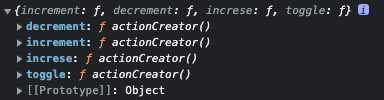

# TIL 간단회고

# Today I Learned

- [x] React (09:30 ~ 1: 30)
- [x] VanillaJS (1 : 45 ~ 4:50 )
- [x] 알고리즘 (5: 00 ~8:10)

---

# 📹 동영상

[](https://youtu.be/gLnMDe1kDUQ)

# React- Section 18 마무리

## 새 프로젝트 준비하기

### 1. 스토어 만들기

```jsx
// index.js

import { createStore } from "redux";

const counterReducer = (state = { counter: 0 }, action) => {
  if (action.type === "increment") {
    return {
      counter: state.counter + 1,
    };
  }

  if (action.type === "decrement") {
    return {
      counter: state.counter - 1,
    };
  }

  return state;
};

const store = createStore(counterReducer);

export default store;
```

### 2. 스토어 제공하기

```jsx
import React from "react";
import ReactDOM from "react-dom";
import { Provider } from "react-redux";

import "./index.css";
import App from "./App";
import store from "./store/index";

ReactDOM.render(
  <Provider store={store}>
    <App />
  </Provider>,
  document.getElementById("root")
);
```

### 3.내부 컴포넌트에서 Ation을 Dispatch하기

```jsx
import classes from "./Counter.module.css";
import { useSelector, useDispatch } from "react-redux";
const Counter = () => {
  const counter = useSelector((state) => state.counter);
  const dispatch = useDispatch();

  const incrementHander = () => {
    dispatch({ type: "increment" });
  };

  const decrementHander = () => {
    dispatch({ type: "decrement" });
  };
  const toggleCounterHandler = () => {};

  return (
    <main className={classes.counter}>
      <h1>Redux Counter</h1>
      <div className={classes.value}>{counter}</div>
      <div>
        <button onClick={incrementHander}>Increment</button>
        <button onClick={decrementHander}>Decrement</button>
      </div>
      <button onClick={toggleCounterHandler}>Toggle Counter</button>
    </main>
  );
};

export default Counter;
```

### 여러 State 속성 작업하기

```jsx
import { createStore } from "redux";
const initState = { counter: 0, showCounter: true };

const counterReducer = (state = initState, action) => {
  if (action.type === "increment") {
    return {
      counter: state.counter + 1,
      showCounter: state.showCounter,
    };
  }

  if (action.type === "decrement") {
    return {
      counter: state.counter - 1,
      showCounter: state.showCounter,
    };
  }

  if (action.type === "increse") {
    return {
      counter: state.counter + 1 + state.amount,
      showCounter: state.showCounter,
    };
  }

  if (action.type === "toggle") {
    return {
      counter: state.counter,
      showCounter: !state.showCounter,
    };
  }

  return state;
};

const store = createStore(counterReducer);

export default store;

// 해당 컴포넌트에서

import classes from "./Counter.module.css";
import { useSelector, useDispatch } from "react-redux";
const Counter = () => {
  const counter = useSelector((state) => state.counter);
  const show = useSelector((state) => state.showCounter);
  const dispatch = useDispatch();

  const incrementHander = () => {
    dispatch({ type: "increment" });
  };

  const decrementHander = () => {
    dispatch({ type: "decrement" });
  };
  const toggleCounterHandler = () => {
    dispatch({ type: "toggle" });
  };

  return (
    <main className={classes.counter}>
      <h1>Redux Counter</h1>
      {show && <div className={classes.value}>{counter}</div>}
      <div>
        <button onClick={incrementHander}>Increment</button>
        <button onClick={decrementHander}>Decrement</button>
      </div>
      <button onClick={toggleCounterHandler}>Toggle Counter</button>
    </main>
  );
};

export default Counter;
```

## Redux Toolkit 사용하기

> Redux Tookit은 redux의 특징을 단순화해준 기능이다

### 1. Store만들기 : Slice

```jsx
import { createStore } from "redux";
import { createSlice } from "@reduxjs/toolkit";
const initState = { counter: 0, showCounter: true };

createSlice({
  name: "counter", // slice의 이름, 식별자 역항을 해줌
  initialState : initState // // 초기 상태
  reducers: {
    // 이 객체안에 메서드를 추가하면된다.
    // 이제 if문을 할필요가 없다 자동으로 최근 값을 받고,  어떤 액션을 했는지에 따라 리덕스에 의해 자동으로 호출받는다
    increment(state) {
      state.counter++; // toolkit에서는 이렇게 해도 괜찮다, 내부적으로 immner가 작동하기 때문이다
    },
    decrement(state) {
      state.counter--;
    },
    increse(state, action) {
      // payload를 받아야하기때문에 매개변수를 받음
      state.counter = state.counter + action.amount;
    },
    toggle(state) {
      state.showCounter = !state.showCounter;
    },
  },
});
.. 생략

```

### 2. 액션 객체 만들기

```jsx
import { createSlice, configureStore } from "@reduxjs/toolkit";
const initState = { counter: 0, showCounter: true };

// 이 세가지 인자는 똑바로 써야함
const counterSlice = createSlice({
  name: "counter", // slice의 이름, 식별자 역항을 해줌
  initialState : initState // 초기 상태
  reducers: {
    // 이 객체안에 메서드를 추가하면된다.
    // 이제 if문을 할필요가 없다 자동으로 최근 값을 받고,  어떤 액션을 했는지에 따라 리덕스에 의해 자동으로 호출받는다
    increment(state) {
      state.counter++; // toolkit에서는 이렇게 해도 괜찮다, 내부적으로 immner가 작동하기 때문이다
    },
    decrement(state) {
      state.counter--;
    },
    increse(state, action) {
      // payload를 받아야하기때문에 매개변수를 받음
      state.counter = state.counter + action.amount;
    },
    toggle(state) {
      state.showCounter = !state.showCounter;
    },
  },
});

console.log(counterSlice.actions.toggle());

const store = configureStore({
  //하지만 reducers가 아니라 하나의 reducer, 즉 단일값이다, 왜냐하면 redux는 하나의 reducer 함수만 있어야 하기 때문
  reducer: counterSlice.reducer,
  // 하지만 slice가 여러개라면?
  // reducer: { counter: counterSlice.reducer }, // 이때 여러 slice가 있다면 객체 key 즉 식별자로 넘겨주는 방법이 있다, 그럼 병합된 모든 slice중에서 원하는 slice에 접근이 가능해진다
}); // 이제 slice에서 설정한 리듀서에 접근할수 있다

// 액션 객체도 같이 내보내자
export const counterActions = counterSlice.actions;

export default store;
```

### 🤔 어떻게 액션 객체를 만들었을까?

> Redux Toolkit이 자동적으로 만들어준다, 메서드를 만들먼 유니크한 액센 타입을 생성해주고, 사용자는 액션객체를 import해와서 dispatch 시키기만 하면 된다
> 

## 코드 정리

```jsx
import { createSlice, configureStore } from "@reduxjs/toolkit";

const initialCounterState = { counter: 0, showCounter: true };

const counterSlice = createSlice({
  name: "counter",
  initialState: initialCounterState,
  reducers: {
    increment(state) {
      state.counter++;
    },
    decrement(state) {
      state.counter--;
    },
    increase(state, action) {
      state.counter = state.counter + action.payload;
    },
    toggleCounter(state) {
      state.showCounter = !state.showCounter;
    },
  },
});

const store = configureStore({
  reducer: { counter: counterSlice.reducer },
});

export const counterActions = counterSlice.actions;

export default store;

// Counter.js

import { useSelector, useDispatch } from "react-redux";

import { counterActions } from "../store/index";
import classes from "./Counter.module.css";

const Counter = () => {
  const dispatch = useDispatch();
  const counter = useSelector((state) => state.counter.counter);
  const show = useSelector((state) => state.counter.showCounter);

  const incrementHandler = () => {
    dispatch(counterActions.increment());
  };

  const increaseHandler = () => {
    dispatch(counterActions.increase(10)); // { type: SOME_UNIQUE_IDENTIFIER, payload: 10 }
  };

  const decrementHandler = () => {
    dispatch(counterActions.decrement());
  };

  const toggleCounterHandler = () => {
    dispatch(counterActions.toggleCounter());
  };

  return (
    <main className={classes.counter}>
      <h1>Redux Counter</h1>
      {show && <div className={classes.value}>{counter}</div>}
      <div>
        <button onClick={incrementHandler}>Increment</button>
        <button onClick={increaseHandler}>Increase by 10</button>
        <button onClick={decrementHandler}>Decrement</button>
      </div>
      <button onClick={toggleCounterHandler}>Toggle Counter</button>
    </main>
  );
};

export default Counter;
```

## 다중 슬라이스 사용하기

> 슬라이스는 여러개를 만들수 있다 해당하는 상태와 리듀서를 만 모아 만들어두면 상태관리하기 편하다

## 코드 분할하기

> configureStore를 통해 slice를 통합할수 있으니 , 굳이 한 file에 담을 필요가 없다

# 프로그래머스 : 2022 KAKAO BLIND RECRUITMENT - 신규 아이디 추천

```jsx
/*
목표 : 입력된아이디와 유사하면서 규칙에 맞는 아이디를 추천
1. 아이디의 길이는 3자 이상 15자 이하
2. 숫자, 빼기(-), 밑줄(_), 마침표(.) 문자만 사용할 수 있습니다.
3. 마침표(.)는 처음과 끝에 사용할 수 없으며 또한 연속으로 사용할 수 없습니다.

예시 : ...!@BaT#*..y.abcdefghijklm
1단계. 대문자를 => 소문자 (toLowerCase을 사용하자)
2단계. 특수문자 제거 (replaceAll)
3단계. ...랑 . 가 하나로 (replaceAll)
4단계. 처음위치한 . 가 사라짐 (앞뒤만 확인하고 replaceAll)
5단계. 빈문자열 제거 => 하지만 빈 문자열은 아님 ((replaceAll))
6단계. 아이디의 길이 2가 이하 => 하지만 2자 이하기 아님 (length 체크)    
*/

function solution(new_id) {
  const answer = new_id
    .toLowerCase()
    .replace(/[^\w-_.]/g, "")
    .replace(/\.{2,}/g, ".")
    .replace(/^\.|\.$/g, "")
    .replace(/^$/, "a")
    .slice(0, 15)
    .replace(/\.$/, "");
  const len = answer.length;
  return len > 2 ? answer : answer + answer.charAt(len - 1).repeat(3 - len);
}
```

# 프로그래머스 : 2022 KAKAO BLIND RECRUITMENT - 문자열 압축

```jsx
function solution(s) {
  //문자열 길이 1인 경우
  if (s.length === 1) return 1;
  let strings = [];
  let answer = 0;
  //첫번째 반복문은 압축할 문자열 길이 1부터 시작 ~ 문자열 길이 / 2
  for (let i = 1; i <= parseInt(s.length / 2); i++) {
    // 절반만 자른다
    let cnt = 1;
    let string = "";
    for (let j = 0; j < s.length; j += i) {
      const current = s.substr(j, i); // 현재 값과 j 부터 i개
      const next = s.substr(j + i, i); // 다음 비교할값 j부터 j+i개를 자름
      console.log(current, next, j, i);
      if (current === next) {
        cnt++; // 같다면 추가
      } else {
        // 아니라면
        string = cnt > 1 ? string + cnt + current : string + current; // 추가된 cnt만큼 넣음
        cnt = 1; // 다시 초기화
      }
    }
    strings.push(string.length); // 값을 추가하고
  }
  return Math.min(...strings); // 이중 가장 작은 값을 넣음
}
```

# 마지막으로

> 내일은 js와 와이어프레임과 UML 작성을 고려해 봐야겠다
