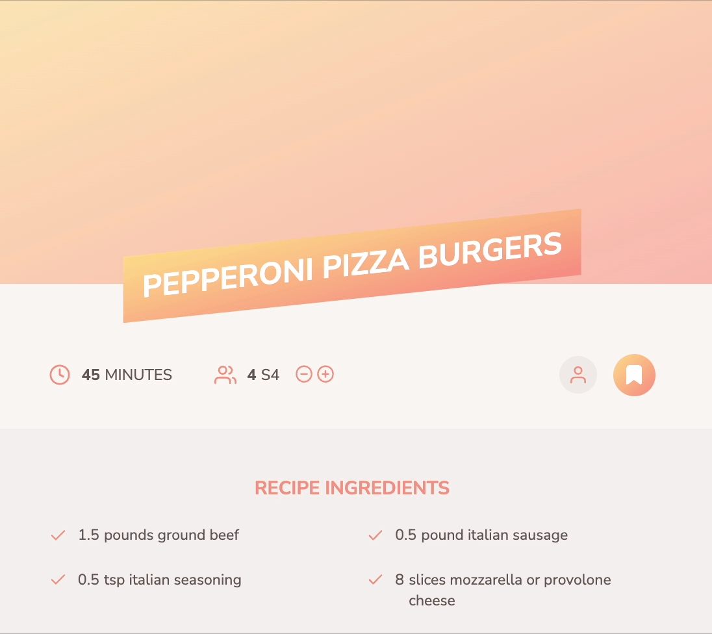

# TIL 간단회고

# Today I Learned

- [x] React (10:00 ~ 1: 25 )
- [x] 프로그래머스 과제 풀이 (1:35 ~ 4:30)
- [x] 알고리즘

---

# 📹 동영상

[](https://youtu.be/I3TRYDUkpAo)

# React : 고급 리덕스

# 리덕스 복습

## Store 만들기

```jsx
// index.js
import { configureStore } from "@reduxjs/toolkit";

import uiSlice from "./ui-slice";
import cartSlice from "./cart-slice";

const store = configureStore({
  reducer: { ui: uiSlice.reducer, cart: cartSlice.reducer },
});

export default store;
```

```jsx
// cart-slice.js
import { createSlice } from "@reduxjs/toolkit";

const cartSlice = createSlice({
  name: "cart",
  initialState: {
    items: [], // 여러 아이템이 담길 배열
    totalQuantity: 0,
  },
  reducers: {
    addItemToCart(state, action) {
      const newItem = action.payload; // 새로운 아이템이 payload로 (어떤게 들어올지 모르니)

      // 이미 존재하는 아이템인경우, 해당 아이템을 찾아준다 (boolean값으로 나옴)
      const existingItem = state.items.find((item) => item.id === newItem.id);
      state.totalQuantity++; // 일단 전체 수량 (장바구니에 있는 items의 수량)을 채워주자

      if (!existingItem) {
        // 이미 있지 않다면?, 그대로 items 배열에 추가하자

        // redux toolkit에는 기본적으로 immer 적용되어 있기 때문에 push로 해도 괜찮다
        state.items.push({
          // item에 들어갈 propoerty들
          id: newItem.id,
          price: newItem.price,
          quantity: 1,
          totalPrice: newItem.price,
          name: newItem.title,
        });
      } else {
        // 존재하면, 해당 item의 수량을 늘려주고
        existingItem.quantity++;
        // price도 올려주자
        existingItem.totalPrice = existingItem.totalPrice + newItem.price;
      }
    },
    removeItemFromCart(state, action) {
      const id = action.payload;
      const existingItem = state.items.find((item) => item.id === id);
      state.totalQuantity--;

      // 이미 있으니, 지운다는 뜻, 1개 남을때는 해당 itme을 filter로 삭제
      // 그 전까지는 계속 줄여나간다
      if (existingItem.quantity === 1) {
        state.items = state.items.filter((item) => item.id !== id);
      } else {
        existingItem.quantity--;
      }
    },
  },
});

export const cartActions = cartSlice.actions;

export default cartSlice;
```

```jsx
// ui-slice.js

import { createSlice } from "@reduxjs/toolkit";

const uiSlice = createSlice({
  name: "ui",
  initialState: { cartIsVisible: false },
  reducers: {
    toggle(state) {
      state.cartIsVisible = !state.cartIsVisible;
    },
  },
});

export const uiActions = uiSlice.actions;

export default uiSlice;
```

### store 구독하기

```jsx
// index.js
import ReactDOM from "react-dom";
import { Provider } from "react-redux";

import store from "./store/index";
import "./index.css";
import App from "./App";

ReactDOM.render(
  <Provider store={store}>
    <App />
  </Provider>,
  document.getElementById("root")
);
```

### cart가 토글할때만 보여지게 하기

```jsx
// App.js
import { useSelector } from 'react-redux';

import Cart from './components/Cart/Cart';
import Layout from './components/Layout/Layout';
import Products from './components/Shop/Products';

function App() {
  const showCart = useSelector((state) => state.ui.cartIsVisible);

  return (
    <Layout>
      {showCart && <Cart />}
      <Products />
    </Layout>
  );
}

export default App;

// CartButton.js
import { useDispatch, useSelector } from 'react-redux';

import { uiActions } from '../../store/ui-slice';
import classes from './CartButton.module.css';

const CartButton = (props) => {
  const dispatch = useDispatch();
  const cartQuantity = useSelector((state) => state.cart.totalQuantity);

  const toggleCartHandler = () => {
    dispatch(uiActions.toggle());
  };

  return (
    <button className={classes.button} onClick={toggleCartHandler}>
      <span>My Cart</span>
      <span className={classes.badge}>{cartQuantity}</span>
    </button>
  );
};

export default CartButton;
```

### 4. cart 아이템이 동적으로 변경되게 하기

```jsx
// Cart.js
import { useSelector } from "react-redux";

import Card from "../UI/Card";
import classes from "./Cart.module.css";
import CartItem from "./CartItem";

const Cart = (props) => {
  const cartItems = useSelector((state) => state.cart.items);

  return (
    <Card className={classes.cart}>
      <h2>Your Shopping Cart</h2>
      <ul>
        {cartItems.map((item) => (
          <CartItem
            key={item.id} // 컴포넌트를 map 돌릴땐 항상 key값을 유지하자
            item={{
              // props로 넘길 item의 목록
              id: item.id,
              title: item.name,
              quantity: item.quantity,
              total: item.totalPrice,
              price: item.price,
            }}
          />
        ))}
      </ul>
    </Card>
  );
};

export default Cart;

// CartItem.js
import { useDispatch } from 'react-redux';

import classes from './CartItem.module.css';
import { cartActions } from '../../store/cart-slice';

const CartItem = (props) => {
  const dispatch = useDispatch();

  const { title, quantity, total, price, id } = props.item;

  const removeItemHandler = () => {
    dispatch(cartActions.removeItemFromCart(id));
  };

  const addItemHandler = () => {
    dispatch(
      cartActions.addItemToCart({ // payload로 item에 들어가는 정보를 넘긴다
        id,
        title,
        price,
      })
    );
  };

  return (
    <li className={classes.item}>
      <header>
        <h3>{title}</h3>
        <div className={classes.price}>
          ${total.toFixed(2)}{' '}
          <span className={classes.itemprice}>(${price.toFixed(2)}/item)</span>
        </div>
      </header>
      <div className={classes.details}>
        <div className={classes.quantity}>
          x <span>{quantity}</span>
        </div>
        <div className={classes.actions}>
          <button onClick={removeItemHandler}>-</button>
          <button onClick={addItemHandler}>+</button>
        </div>
      </div>
    </li>
  );
};

export default CartItem;
```

### 5. 쇼핑몰에 있는 item을 장바구니로 넣기 (더미 아이템을 이용)

```jsx
// Products.js

import ProductItem from './ProductItem';
import classes from './Products.module.css';

const DUMMY_PRODUCTS = [
  {
    id: 'p1',
    price: 6,
    title: 'My First Book',
    description: 'The first book I ever wrote',
  },
  {
    id: 'p2',
    price: 5,
    title: 'My Second Book',
    description: 'The second book I ever wrote',
  },
];

const Products = (props) => {
  return (
    <section className={classes.products}>
      <h2>Buy your favorite products</h2>
      <ul>
        {DUMMY_PRODUCTS.map((product) => (
          <ProductItem
            key={product.id}
            id={product.id}
            title={product.title}
            price={product.price}
            description={product.description}
          />
        ))}
      </ul>
    </section>
  );
};

export default Products;

// ProductItem.js

import { useDispatch } from 'react-redux';

import { cartActions } from '../../store/cart-slice';
import Card from '../UI/Card';
import classes from './ProductItem.module.css';

const ProductItem = (props) => {
  const dispatch = useDispatch();

  const { title, price, description, id } = props;

  const addToCartHandler = () => { // 장바구니로 추가한다
    dispatch(
      cartActions.addItemToCart({
        id,
        title,
        price,
      })
    );
  };

  return (
    <li className={classes.item}>
      <Card>
        <header>
          <h3>{title}</h3>
          <div className={classes.price}>${price.toFixed(2)}</div>
        </header>
        <p>{description}</p>
        <div className={classes.actions}>
          <button onClick={addToCartHandler}>Add to Cart</button>
        </div>
      </Card>
    </li>
  );
};

export default ProductItem;
```

### 결과물



## 리덕스의 비동기처리

> 리덕스는 순수함수이기 때문에 외부객체를 변경하는 비동기 처리나, side-effect 관련 업무를 하면 안된다!

- ACtion creators를 사용하거나
- uesEffect()를 이용해 컴포넌트에서 사용하거나
  로 해결할수 있다

```jsx
// App.js
import { useSelector } from "react-redux";
import { useEffect } from "react";
import Cart from "./components/Cart/Cart";
import Layout from "./components/Layout/Layout";
import Products from "./components/Shop/Products";

function App() {
  const showCart = useSelector((state) => state.ui.cartIsVisible);
  const cart = useSelector((state) => state.cart);

  // 이렇게하면 일단 redux에 의해 cart값이 변경될때마다 BE에 저장하는것과 같다
  useEffect(() => {
    fetch("https://react-http-6b4a6.firebaseio.com/cart.json", {
      method: "PUT",
      body: JSON.stringify(cart),
    });
  }, [cart]);
  return (
    <Layout>
      {showCart && <Cart />}
      <Products />
    </Layout>
  );
}

export default App;
```

# 알고리즘

## 14719 : 빗물

```jsx
// 14719
/* 

첫째줄로 2차원 배열을 만들고
둘쨰 줄로 해당 위치를 true로 만들자
그리고 돌면서 처음 true가 나온곳과 다음 true가 나온 차이를 구해서
전부다 돌면 구해질듯하다

*/

testCase = require("fs")
  .readFileSync(process.platform == "linux" ? "/dev/stdin" : "예제.txt")
  .toString()
  .trim()
  .split("\n");
const [col, row] = testCase.shift().split(" ").map(Number);

const arr = testCase[0].split(" ").map(Number);

dimension = Array.from(Array(col), () => Array(row + 1).fill(false));

arr.map((el, idx) => {
  for (let i = 0; i < el; i++) {
    dimension[i][idx + 1] = true;
  }
});

let answer = 0;
let prv = 0;

for (let i = 0; i < col; i++) {
  let betweenTrue = [];
  for (let j = 1; j <= row; j++) {
    if (dimension[i][j]) {
      betweenTrue.push(j);
      if (betweenTrue.length == 2 && betweenTrue[1] - betweenTrue[0] == 1) {
        betweenTrue.shift();
      }
    }

    if (betweenTrue.length == 2) {
      console.log(betweenTrue, i, j);
      answer += betweenTrue[1] - betweenTrue[0] - 1;
      betweenTrue.shift();
    }
  }
}
console.log(answer);
// 26분
```

## 14888 : 연산자 끼워넣기

```jsx
// 14888

/* 
첫째줄 testCase Number
둘째줄 연살할 수
셋째줄 연산자개수

DFS로 조합을 돌리면 될듯?

*/

testCase = require("fs")
  .readFileSync(process.platform == "linux" ? "/dev/stdin" : "예제.txt")
  .toString()
  .trim()
  .split("\n");

num = testCase.shift();
arr = testCase.shift().split(" ").map(Number);
[add, mius, multy, divi] = testCase[0].split(" ").map(Number);
answer = [];

let maximum = -1e9;
let minimum = 1e9;
const make = (depth, total, add, mius, multy, divi) => {
  if (num == depth) {
    maximum = Math.max(total, maximum);
    minimum = Math.min(total, minimum);
    return;
  }
  if (add) make(depth + 1, total + arr[depth], add - 1, mius, multy, divi);
  if (mius) make(depth + 1, total - arr[depth], add, mius - 1, multy, divi);
  if (multy) make(depth + 1, total * arr[depth], add, mius, multy - 1, divi);
  if (divi)
    make(depth + 1, parseInt(total / arr[depth]), add, mius, multy, divi - 1);
};

make(1, arr[0], add, mius, multy, divi);
console.log(maximum + "\n" + minimum);
```

---

# 마지막으로

> 내일은 와이어 프레임 준비를 해보자
