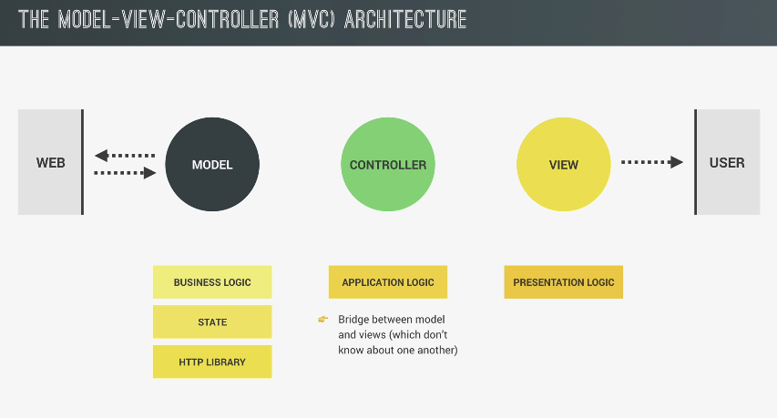
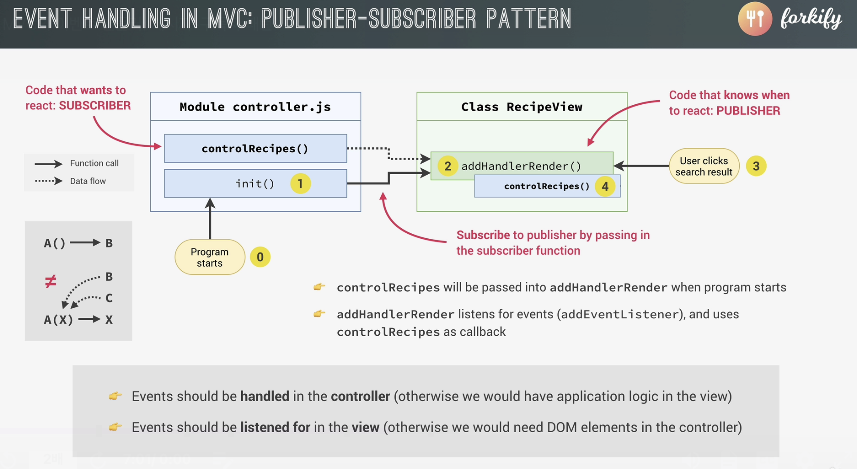

# TIL 간단회고

> 이번주에 JS부분은 끝날것 같다, JS 관련 실습은 바닐라JS스터디 과제로 마무리한다 생각하자
> 이제 TS랑 node.js를 중점적으로 돌리면 될것같다
> 알고리즘은 어느 방향으로 가야할지 감이 안잡힌다, 알고리즘 관련 스터디를 알아보면 좋을것 같다

# Today I Learned

- [x] VanillaJS
- [x] 알고리즘

---

# 📹 동영상

[](https://youtu.be/jpj0Kw8WzBI)

# VanillaJS

## The MVC Architecture

> 아키텍처의 구조, 유지보수, 확장성을 모두 고려하는건 중요하다, 하지만 서비스의 규모가 커짐에 따라 개인이 감당하기 힘들다
> 이미 증면된 디자인 패턴이나 프레임워크를 사용하면 좋다

## Architecture의 구성요소

- Business Logic
- state
- HTTP Library
- Application Logic
- presentation logic

## MVC Architecture



- view에서 이벤트가 발생하면 controller에서 관리를 하고 해당 로직을 model이 처리한다

## Refactoring for MVC

### View

```jsx
import icons from "url:../../img/icons.svg"; // parcel 2
class RecipeView {
  #parentElement = document.querySelector(".recipe"); // 컨트롤에서 사용하면 좋다, 하지만 하나이상의 view를 만들게되면 받아올때마다 하나하나 지정해줘야하니, 객체를 생성하자
  #data; // render에 들어갈 데이터

  render(data) {
    this.#data = data;
    const markup = this.#generateMarkup();
    this.#clear;
    this.#parentElement.insertAdjacentHTML("afterbegin", markup); //
  }

  #clear() {
    this.#parentElement.innerHTML = "";
  }

  // 이것은 캡슐화 하지 않고, controller에서 사용할수 있게 한다
  renderSpinner = function () {
    const markup = `
      <div class="spinner">
      <svg>
        <use href="${icons}#icon-loader"></use>
      </svg>
    </div> 
    `;
    this.#parentElement.innerHTML = "";
    this.#parentElement.insertAdjacentHTML("afterbegin", markup);
  };

  #generateMarkup() {
    return `
      <figure class="recipe__fig">
        
        <h1 class="recipe__title">
          <span>${this.#data.title}</span>
        </h1>
      </figure>

      <div class="recipe__details">
        <div class="recipe__info">
          <svg class="recipe__info-icon">
            <use href="${icons}#icon-clock"></use>
          </svg>
          <span class="recipe__info-data recipe__info-data--minutes">${
            this.#data.cookingTime
          }</span>
          <span class="recipe__info-text">minutes</span>
        </div>
        <div class="recipe__info">
          <svg class="recipe__info-icon">
            <use href="${icons}#icon-users"></use>
          </svg>
          <span class="recipe__info-data recipe__info-data--people">4</span>
          <span class="recipe__info-text">s${this.#data.servings}</span>

          <div class="recipe__info-buttons">
            <button class="btn--tiny btn--increase-servings">
              <svg>
                <use href="${icons}#icon-minus-circle"></use>
              </svg>
            </button>
            <button class="btn--tiny btn--increase-servings">
              <svg>
                <use href="${icons}#icon-plus-circle"></use>
              </svg>
            </button>
          </div>
        </div>

        <div class="recipe__user-generated">
          <svg>
            <use href="${icons}#icon-user"></use>
          </svg>
        </div>
        <button class="btn--round">
          <svg class="">
            <use href="${icons}#icon-bookmark-fill"></use>
          </svg>
        </button>
      </div>

      <div class="recipe__ingredients">
        <h2 class="heading--2">Recipe ingredients</h2>
        <ul class="recipe__ingredient-list">
        ${this.#data.ingredients
          .map((ing) => {
            return `
            <li class="recipe__ingredient">
            <svg class="recipe__icon">
              <use href="${icons}#icon-check"></use>
            </svg>
            <div class="recipe__quantity">${ing.quantity}</div>
            <div class="recipe__description">
              <span class="recipe__unit">${ing.unit}</span>
              ${ing.description}
            </div>
          </li>
          `;
          })
          .join("")}
      
        </ul>
      </div>

      <div class="recipe__directions">
        <h2 class="heading--2">How to cook it</h2>
        <p class="recipe__directions-text">
          This recipe was carefully designed and tested by
          <span class="recipe__publisher">${
            this.#data.publisher
          }/span>. Please check out
          directions at their website.
        </p>
        <a
          class="btn--small recipe__btn"
          href="${this.#data.sourceUrl}"
          target="_blank"
        >
          <span>Directions</span>
          <svg class="search__icon">
            <use href="${icons}#icon-arrow-right"></use>
          </svg>
        </a>
      </div>
  `;
  }
}
export default new RecipeView(); // 이렇게 하면 여러 view를 생성하기 쉽다
```

### controller.js

```jsx
import * as model from "./model.js";

import "core-js/stable";
import "regenerator-runtime/runtime";
import recipeView from "./views/recipeView.js";
const recipeContainer = document.querySelector(".recipe");

const timeout = function (s) {
  return new Promise(function (_, reject) {
    setTimeout(function () {
      reject(new Error(`Request took too long! Timeout after ${s} second`));
    }, s * 1000);
  });
};

// https://forkify-api.herokuapp.com/v2

///////////////////////////////////////

const controlRecipe = async function () {
  try {
    // getHash
    const id = window.location.hash.slice(1);

    // guard clause
    if (!id) return;

    // loding svg
    recipeView.renderSpinner();

    // 1) Loding Recipe (from model.js)
    await model.loadRecipe(id);
    const { recipe } = model.state; // 순수함수를 위해 사본으로 반환

    // 2) Rendering recipe
    recipeView.render(model.state.recipe); // 1. new 연산자는 view에 있기 때문에, RecipeView에 데이터를 전달할수 없다, 그렇기 떄문에 render라는 메서드로 객체를 만들수 있다 (render패턴임, 실제 메서드가 아니다)
    // 1.1 render가 없다면 const recipeView = new RecipeView(model.state.recipe)로 생성해야한다
    // 2. 이제 model.state.recipe = 즉 레시피가, view의 데이터로 간다, view에서 markUp을 렌더링 하면 된다
    추가하자;
  } catch (err) {
    console.error(new Error());
  }
};
// showRecipe();

["hashchange", "load"].forEach((ev) =>
  window.addEventListener(ev, controlRecipe)
);

// window.addEventListener('hashchange', showRecipe); // 이걸 동적으로 사용해보자
// window.addEventListener('load', showRecipe); // load이벤트를 추가
```

### model

```jsx
// model.js
import { async } from "regenerator-runtime";

export const state = {
  recipe: {},
};

export const loadRecipe = async function (id) {
  try {
    // loding recipe

    const res = await fetch(
      `https://forkify-api.herokuapp.com/api/v2/recipes/${id}`
    );
    const data = await res.json();

    // Gruad Cluase
    if (!res.ok) throw new Error(`${data.message} (${res.status})`);

    let { recipe } = data.data;
    state.recipe = {
      id: recipe.id,
      title: recipe.title,
      publisher: recipe.publisher,
      sourceUrl: recipe.source_url,
      image: recipe.image_url,
      servings: recipe.servings,
      cookingTime: recipe.cooking_time,
      ingredients: recipe.ingredients,
    };

    // console.log(recipe);
  } catch (err) {
    alert(err);
  }
};
```


# Publisher-Subscriber Design pattern



# 프로그래머스 정리

### **1번 문제**


- 정답은 '오류가 발생한다'
- `apply`, `call`, `bind` 등으로 `this`에 대해 주입한 상황이 아니고 `new` 키워드없이 실행한 함수 내 this는 전역 객체(window)를 바라본다.
- 즉 `this.name = name`의 결과는 `window.name = name` 이라는 이야기.

### **2번 문제**


- `hello roto`가 출력된다.
- `와 `로 감싼 문자열은 ES6에 있는 `template strings`라는 문법으로,
- 즉시 실행 함수 표현(IIFE, Immediately Invoked Function Expression)이라고 하며, 함수를 정의함과 동시에 실행한다.
- JavaScript 특성상 변수의 scope는 해당 변수를 감싸고 있는 function에 한정되는데, 이걸 이용해 변수나 함수의 전역화를 최소화 시킬 수 있다.
- 다음은 대표적인 IIFE의 응용이다.

```
var logger = (function(){
// logCount는 밖에서 접근할 수 없다. 일종의 private 효과var logCount = 0;
functionlog(message) {
    console.log(message);
    logCount = logCount + 1;
  }
functiongetLogCount() {
return logCount;
  }
return {
    log: log,
    getLogCount: getLogCount
  }
})()

```

### **3번 문제**


- function scope 관련 문제
- 정답은 `band undefined roto play start.` 출력
- play 함수의 this 내에는 name이 없기 때문에 undefined가 출력 되는 것
- 해결법

```
var idiots = {
  name: 'idiots',
  genre: 'punk rock',
  members: {
    roto: {
      memberName: 'roto',
      play:function() {
        console.log(`band ${idiots.name} ${this.memberName} play start.`
      }
    }
  }
}

```

### **4번 문제**


- 맨 아래 `theOralCigarettees.perform()`을 실행하는 게 빠졌네요..
- `perform` 함수 아래 `setTimeout`으로 인해 실행되는 함수의 `this`는 `RockBand`의 `this`가 아니기 때문에, 참조 오류가 발생
- 클로저를 이용한 해결법

```
functionRockBand(members) {
var that = this;
    this.members = members;
    this.perform =function() {
      setTimeout(function(){
        that.members.forEach(function(member){ member.perform() })
      }, 1000)
    }
  }

var theOralCigarettes =new RockBand([
    {
      name: 'takuya',
      perform:function() { console.log('a e u i a e u i')}
    }
  ])

  theOralCigarettes.perform()

```

- bind를 이용한 해결법

```
functionRockBand(members) {
var that = this;
    this.members = members;
    this.perform =function() {
      setTimeout(function(){
        this.members.forEach(function(member){ member.perform() })
      }.bind(this), 1000)
    }
  }

var theOralCigarettes =new RockBand([
    {
      name: 'takuya',
      perform:function() { console.log('a e u i a e u i')}
    }
  ])

  theOralCigarettes.perform()

```

### **5번 문제**


- 전형적인 클로져 문제
- setTimeout이 실행되는 시점에는 루프가 이미 끝나있어서 i는 5가 들어가있어서 생기는 문제
- i를 var 대신 `let`을 쓰는 걸로 해결할 수 있음
- 혹은 setTimeout을 IIFE로 감싸고, 파라메터로 i를 넘기는 것으로 해결 가능

```
const numbers = [1, 2, 3, 4, 5];
for(var i = 0; i < numbers.length; i++){
  (function(count){
    setTimeout(function(){
      console.log(`number index ${count}`);
    }, 1000);
  })(i)
}

```

### **6번 문제**

for문을 이용한 방법

```
function printCats() {
  const userNames = []
  for(let i = 0; i < users.length; i++) {
    if (users[i].type === 'cat') {
      userNames.push(users[i].name);
    }
  }
  console.log(userNames.join(''));
}

```

es5를 이용한 방법

```
function printCats() {
  console.log(users.filter(user => user.type === 'cat').map(user => user.name).join(''));
}

```

### **7번 문제**

### **var, let, const의 차이**

- var: function level scope를 가지며 이로 인해 호이스팅 현상이 일어난다. 재할당 가능
- let: block level scope를 가지며 재할당이 가능하다.
- const: block level scope를 가지며 재할당이 불가능하다. 그러나 할당된 객체의 함수를 이용해 객체를 변경하는 일은 가능하다.

```
const arr1 = []

arr1 = [1,2]; // Error!

// 가능
arr1.push(1);
arr1.push(2);

```

### **8번 문제**

### **클로저란?**

아래 문서를 참고하자.

- https://developer.mozilla.org/ko/docs/Web/JavaScript/Guide/Closures
- https://hyunseob.github.io/2016/08/30/javascript-closure/

# 마지막으로

> 내일은 react를 잘 나가고, 리덕스 복습을 잘해보자
