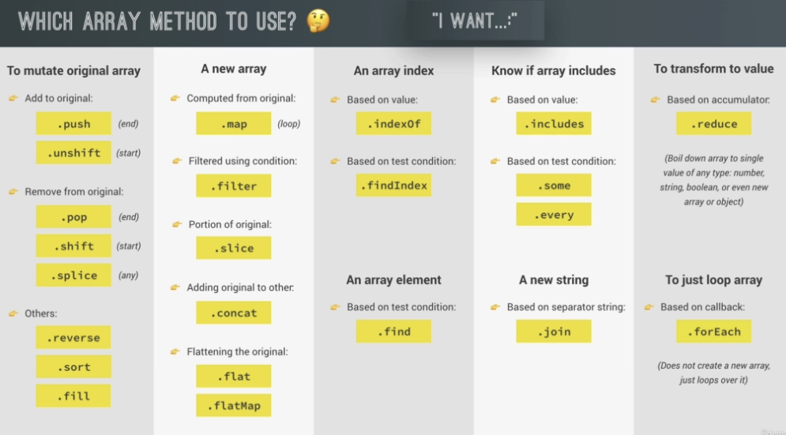

# TIL 간단회고

> TIL이 생각보다 시간을 너무 많이 써서 내 공부법을 넣어 하기로 했다! (동영상)

# Today I Learned

- [x] 토익
- [x] VanilaJS

---

[!section11](https://youtu.be/4VifJIOvmco)

# Section 11 :

##배열 메소드

- slice
- splice
- reverse
- concat
- join
- at
- forEach
- map
- filter
- reduce
- find
- some
- every
- includes
- flat
- flatMap
- sort()
- fill
- fillMap
  

# Section 12 :

- JS는 부동 소수점
- 오차는 EPSILON
- PasesInt
- isNaN
- isFinite
- isInteger
- sqrt : 제곱근
- max, min
- PI
- trunc : 소수점을 자름
- random
- round
- ceil
- floor
- Numeric Separators (\_)
- Bigint(n)
- new Date
- 타임스탬프로 날짜 데이터끼리 비교
- Intl로 날짜, 넘버를 지역별로 설정하기 용이함
- setTimeout
- setInterval

---

# 마지막으로

> 내일도 아침일찍 잘 갔다 오자, UXUI도 얼른 마무리해서 다음주 발표를 미리 준비해야겠다
